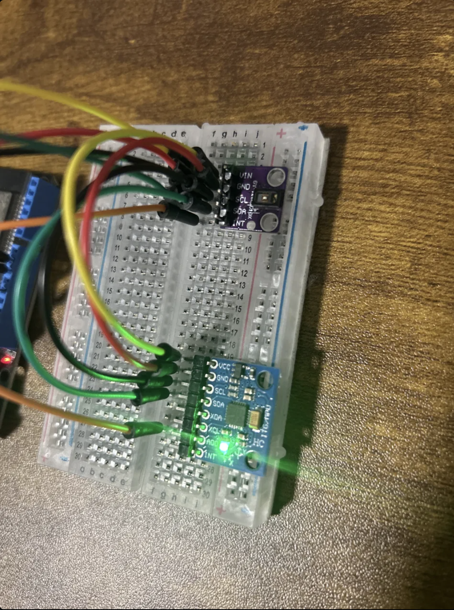
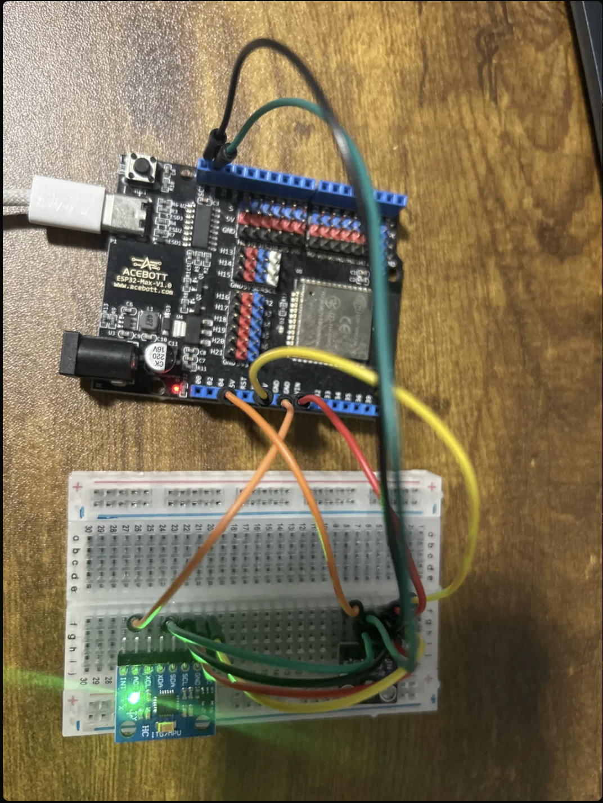

# Vital Stack

A real time physiological monitoring system built on ESP32, written entirely in C without any HAL abstraction. Every driver I2C, MAX30102, MPU6050 was written from scratch by reading the datasheet, understanding every register, and deriving every bit value before writing a single line of code.

This isn't a tutorial project. It's a learning system built to answer one question: *can I write firmware I actually own?*

---

## What it does

- Reads heart rate and SpO2 data from the MAX30102 optical sensor
- Reads 3-axis acceleration from the MPU6050 IMU
- Uses the accelerometer to qualify PPG samples in real time — if motion is detected above 1.5g at the moment a PPG sample arrives, the sample is flagged as corrupted
- Runs a FreeRTOS task triggered by a hardware interrupt from the MAX30102, not polling
- Includes a 1 second watchdog timeout that pings both sensors if no interrupt fires — detecting sensor failure silently in the background

---

## Project

Every register write has a reason. Every bit field was derived from the datasheet. The I2C driver generates START, STOP, ACK, and NACK conditions manually using GPIO bit-banging. The sensor drivers know nothing about FreeRTOS. The FreeRTOS task knows nothing about I2C. Each layer does exactly one job.

The goal wasn't to build the most sophisticated health monitor. It was to learn and write firmware from scratch.

---

## System Architecture

MAX30102 (PPG sensor) ──I2C──┐
├── ESP32 (FreeRTOS)
MPU6050 (Accelerometer) ─I2C─┘
│
└── GPIO4 (INT pin) ──► ISR ──► Binary Semaphore ──► Sensor Task

 **Task flow:**
1. MAX30102 FIFO fills to threshold (17 samples at 100sps ≈ every 170ms)
2. INT pin pulls low → ISR fires → gives binary semaphore → immediate context switch
3. FreeRTOS sensor task wakes → reads MAX30102 → reads MPU6050
4. Calculates acceleration magnitude: `√(ax² + ay² + az²)`
5. If magnitude > 1.5g → PPG sample flagged as motion-corrupted
6. Task blocks again, waiting for next interrupt

---

## Hardware

| Component | Role | Interface |
|---|---|---|
| ESP32 (Acebott MAX V1) | Main controller | — |
| MAX30102 | Heart rate + SpO2 | I2C (0x57) |
| MPU6050 | 3-axis accelerometer | I2C (0x68) |

**Wiring:**

ESP32 GPIO21 → SDA (both sensors)
ESP32 GPIO22 → SCL (both sensors)
ESP32 GPIO4  → MAX30102 INT
ESP32 3V3    → VCC (both sensors)
ESP32 GND    → GND (both sensors)
MPU6050 AD0  → GND (sets address to 0x68)

---

## Challenges

### 1. The clone sensor problem
Both sensors arrived from Amazon. Both failed their part ID checks on first boot, the MAX30102 returned `0x00` instead of `0x15`, and the MPU6050 returned `0x00` instead of `0x68`. Classic counterfeit hardware.

The move was to add systematic debug prints at every stage of init — isolate the I2C read, check the return value, print the raw byte. This revealed that I2C was working perfectly and the sensors were communicating — they just weren't genuine chips.

The MPU6050 clone works fine for accelerometer data. The MAX30102 clone triggers interrupts and accepts all register writes but its optical hardware produces zero data.

### 2. Understanding what "sleep mode" actually means
The MPU6050 boots in sleep mode by default — the datasheet says this clearly, but it's easy to miss. The accelerometer signal paths are powered down in sleep. Writing `PWR_MGMT_1 = 0x08` clears the SLEEP bit and wakes the device. Without this, every register read returns stale or zero data, and it looks like an I2C problem when it isn't.

### 3. Binary semaphore vs global flag
The first instinct for ISR-to-task signaling was a `volatile uint8_t flag`. A global flag works, but the task has to poll it constantly — burning CPU doing nothing useful. A FreeRTOS binary semaphore lets the task sleep completely between interrupts and wake instantly when the ISR fires. At 100sps with interrupts every 170ms, the task is asleep more than 99% of the time.

---

## Hardware Photos

### Sensors

### Full Setup

---

## Built with

- ESP-IDF v5.5.2
- FreeRTOS (bundled with ESP-IDF)
- C99
- A lot of datasheet reading
